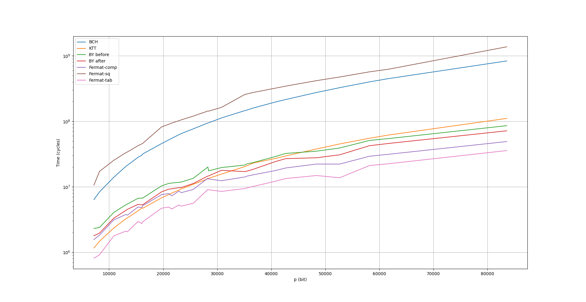
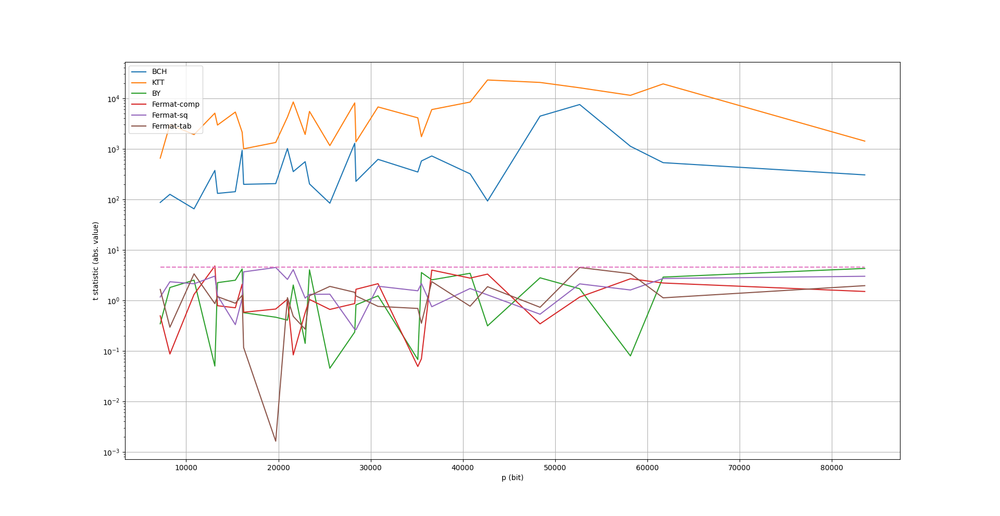

# Computer Engineering project:   Post Quantum Cryptography

## Introduction
[LEDAcrypt](https://www.ledacrypt.org/) is a suite of post-quantum asymmetric code-based cryptosystems: these kind of cryptosystems have a remarkably good security track, however this strenght comes at the disadvantage of large public key sizes; a possible way to reduce the key size is to employ code families admitting a space-efficient representation, such as quasi-cyclic moderate-density parity check <b>(QC-MDPC)</b>.

QC codes are characterized by having the generator and parity check matrices composed by <i>p x p </i> circulant blocks, which arithmetic is isomorphic to the one of the polynomials modulo <i>x^p - 1</i> over the 
same field. 

In the LEDAcrypt primitives, the calculation of the inverse of such a matrix is fundamental to generate public/private key pairs, and we can exploit the above mentioned isomorphism to use a polynomial inversion algorithm; even though the computation of a multiplicative inverse polynomial is required only once during the execution of the key generation algorithm, the degree of the involved operand requires to implement carefully this operation. 
More detailed information about the LEDAcrypt cyphersuite can be found [here](https://github.com/LEDAcrypt/LEDAcrypt/blob/master/Supporting_Documentation/specification_LEDAcrypt_revision_3.pdf)

The goal of this project is to optimize the key generation primitive, in particular by optimizing the [Bernstein-Yang](https://gcd.cr.yp.to/safegcd-20190413.pdf) polynomial inversion algorithm (see below).

### Contents
The repository contains:
<ul>
<li> <b>docs:</b> the documentation regarding the testing framework andthe LEDAcrypt specification, from which the former was extracted
<li> <b>scripts:</b> python and bash scripts to automate the code generation, testing and analysis processes
<li> <b>logs:</b> test results used to evaluate the progress made during the development 
<li> <b>src:</b> C11 implementation of the testing framework and the inversion algorithms to evaluate
</ul>

A brief explanation of the work done (in italian) can be found [here](docs/report/main.pdf)

## How it works
### The BY algorithm
The BY algorithm for polynomial inversion adopts a <i>divide et impera</i> strategy, splitting the operands recursively (calling the <code>jumpdivstep</code> function) until they become as small as a machine word size; at this point, the <code>divstep</code> function is invoked.

By analyzing the pseudocode, we can see that the <code>jumpdivstep</code> function calls itself twice, to <i>operate</i> on both halves of the input operands: in the first case, the callee operands are a portion of the caller operands (<i>f(x) mod x^j</i>), while in the second case to calculate the callee operands we also need the results of the first call. The results of the two calls are then <i>recombined</i> and returned to the caller.

We can represent the evolution of <code>jumpdivstep</code> calls by the means of a recursion tree, where the root represents the absolute first <code>jumpdivstep</code> call, a node's right child represents the first recursive call and a node's left child represent the second one. 

### The optimization strategy
We can reconstruct the recursion tree by <i>emulating</i> the calls order, associating all the parameters necessary for a call with its corresponding tree node: for a given input operand size, the function calls order, the parameters and the relative memory position accessed will always be the same: this means that we can generate a specific source code for each value of <i>p</i>.
By itself, generating a sequential version of the code does not boost much the performance of the algorithm, but allows us to optimize the multiplication operations.

In the original version, multiplications are handled by the <code>gf2x_scalarprod</code> function: this unfortunately requires, if the operand sizes are different, that the smaller one is moved into a buffer to match the lenght of the larger one by adding zeros (the polynomials are represented in a compact dense binary form, bits in a byte are in Big-Endian format, see [here](src/gf2x/include/gf2x_arith.h) for further details). This passage can be avoided by splitting the multiplication into smaller parts having operands of the same size, recombining the subproducts with the respective offsets by adding them; by doing so, we can also use size-specific multiplication strategies for operands shorter than 9 DIGITs.
In most of the cases, the upper part of the result of a moltiplication is cut, so we can avoid calculating the most significant bits and save some more time.
The same approach can be also applied when calculating the <i>left operands</i>, by cutting the unnecessary part and shifting the bits directly in place.

### Results
The application of the above mentioned optimization resulted in a 18% faster algorithm that still keeps its constant-time nature, as we can see from the t-value. The dashed line represents the 4.5 threshold under which we state that the timing results obtained for a random element and a fixed trinomial (<i>x^2+x+1</i>) are independent with a confidence of 99.999%.

Mean 
 

Student's T

## License
The code is hereby placed in the public domain.
For further details, check the [license](LICENSE).

The code which was not directly authored by the implementor
is the one relative to the testing framework: the included implementations were released
by the respective authors under public domain, and the implementor hereby re-license the present copy under public domain.
